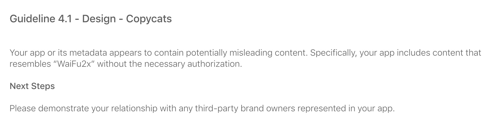

#  Waifu2x-mac


Waifu2x port to macOS, also in Core ML and Metal. For other details please refer to [waifu2x-ios](https://github.com/imxieyi/waifu2x-ios).

## Project Status
I can't believe this really happened:



My update to the "waifu magnifier" on macOS just got rejected. I admit that it's my fault that I never appealed the so-called "Waifu2x" app which pirated my code in this repo to Apple.

I was still updating this project since that person pirated my code back in 2018. All of this suddenly becomes a joke now.

I am extremely upset about all of this. ~~**So I decided to completely abandon this project.**~~

~~You can still download past releases and send PRs for improvements. But don't expect any update from me in the future.~~

**Update (2021-10-28):** The developer of "WaiFu2x" responded to my complaint through Apple. They have removed their App from the App Store and released the name. After calming down I have re-considered the future of this project. It was a huge mistake that I chose MIT as license. I'll still work on this in the future, but all newer changes will be released under a more strict license.

## About [waifu2x](https://itunes.apple.com/app/waifu2x/id1286485858) on the Mac App Store
The app waifu2x on the MAS is based on waifu2x-ios instead of this project. It runs through [Mac Catalyst](https://developer.apple.com/mac-catalyst/).

## Disclaimer
I haven't published an app based on this project to the Mac App Store. If any app appears on the store that looks like this project, it has nothing to do with me.

## Requirements
 - macOS 10.13+ (Running)
 - Xcode 11.1+ (Building)

## Download
Note that all pre-built binaries are not signed. You can either sign them yourself or go to system settings to bypass the signature check.

### From Releases
Go to [Releases](https://github.com/imxieyi/waifu2x-mac/releases) to get pre-built binaries. Not all release versions contain both GUI and CLI.

### From GitHub Actions
Go to [Actions](https://github.com/imxieyi/waifu2x-mac/actions) to fetch the latest build for both GUI and CLI. They will be removed automatically 90 days after being built.

### Homebrew (Experimental, CLI only)
If you want to install with homebrew:
```bash
brew install imxieyi/waifu2x/waifu2x
```
**It downloads pre-built binary from [releases](https://github.com/imxieyi/waifu2x-mac/releases). Xcode is not needed.**

## Compilation Instructions
### Option A (automatic):
1) Open the Terminal (⌘+Space, "terminal")
2) Drag `build.sh` from Finder to the Terminal window, and press Return to start building the app.  
   All missing dependencies (including Xcode) will be installed automatically by the script if needed.
3) Once the build has completed, the `waifu2x-mac-app` application can be found in the `build` folder.

### Option B (manual):
1) Build using `waifu2x-mac-app` scheme 
2) To locate the built macOS app, expand the Products folder on Project Navigator (left pane) and right click on `waifu2x-mac-app.app` to select **Show in Finder**

## Installing the App and CLI Version
The app can be dragged to any location you choose, such as `/Applications`.

If you would like to use the CLI version, right click on the app and select **Show Package Contents**. Navigate to `Contents/MacOS`. The CLI version is `waifu2x`.

If you would like to run the program anywhere, you must create a symbolic link by typing `ln -s /path/to/waifu2x /usr/local/bin/waifu2x` in a terminal. You can also drag the waifu2x executable after `ln -s ` to get the file path in terminal automatically.

> For example, if waifu2x-mac-app is in `/Applications`, you would run the following command to create a symlink:  
`ln -s /Applications/waifu2x-mac-app.app/Contents/MacOS/waifu2x /usr/local/bin/waifu2x`

**N.B.:** You can not drag the CLI executable out and use it directly as it will not work. You must create a symbolic link as shown above if you want to use it without going into the `waifu2x-mac-app.app` directory.  
Additionally the symbolic link will break if you move the macOS app. You can delete the old symlink with `unlink /usr/local/bin/waifu2x` and run `ln -s` again to create a new one.

## Command-Line Usage
```
Usage: waifu2x [options]
    -t, --type:
        Image type - a for anime (default), p for photo
    -s, --scale:
        Scale factor (1 or 2)
    -n, --noise:
        Denoise level (0-4)
    -i, --input:
        Input image file (any format as long as NSImage loads)
    -o, --output:
        Output image file (png)
    -h, --help:
        Print usage
```
**WARNING:** The CLI version is not a self-contained executable. `waifu2x` must remain in the same directory as `CommandLineKit.framework` and `waifu2x_mac.framework`.
